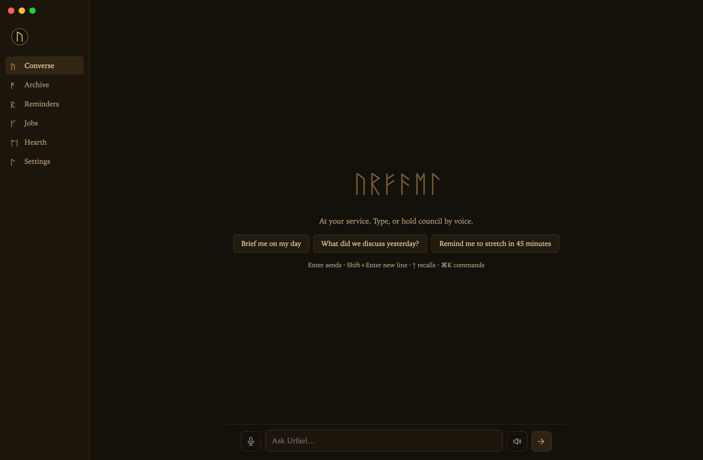

<div align="center">


# U R F A E L


**A personal, voice-capable AI assistant you run on your own machine. Built security-first, on the flat-rate Claude subscription you already have. No inbound port to attack. No per-token meter running.**

It listens and speaks locally, sandboxes every autonomous action fail-closed, allowlists who can reach it, regression-tests itself against its own adversarial attacks, and tells you plainly what's battle-tested and what isn't.

[](#install)
[](#install)
[](#voice)
[](#security)
[](docs/SECURITY-BENCHMARK.md)
[](LICENSE)

<br/>


<sub><code>npm run security</code> boots the real daemon and runs the actual attack classes that owned other agents in the wild. It lands on 11/11 classes, 125/125 checks. The proof is a command you run, not a claim you read.</sub>

<br/><br/>



<sub>The Console: chat with live tool activity, push-to-talk, archive, reminders, jobs, settings. One window, keyboard-first.</sub>

</div>

> The other self-hosted assistants optimize for channel count and star count. Urfael optimizes for not getting owned, and for not lying to you about what it can do.

<sub>📖 **The full manual** is a navigable, searchable docs site at [`docs/manual/`](docs/manual/) (install, quickstart, every feature, all 19 channels, the security model, and an auto-generated [CLI reference](docs/manual/reference/cli.md)). Machine-readable index at [`docs/llms.txt`](docs/llms.txt). 📄 The shareable landing page lives at [`docs/index.html`](docs/index.html) (enable GitHub Pages → `/docs` to serve both).</sub>

---

## Contents

- [Why Urfael](#why-urfael) · [the honest comparison](#how-it-compares)
- [Highlights](#highlights)
- [Security model](#security): the moat · [ARCHITECTURE.md](ARCHITECTURE.md): one brain, one socket, the whole system in 5 minutes
- [Install](#install) & [Quick start](#quick-start)
- [The surfaces](#the-surfaces): Console · orb · TUI · web dashboard
- [Channels](#channels) · [Voice](#voice) · [Memory & recall](#memory--recall) · [Coding](#coding) · [Cost](#cost)
- [What's lightly tested](#whats-lightly-tested): read this
- [Who this is *not* for](#who-this-is-not-for)
- [The name](#the-name) · [Contributing](#contributing) · [License](#license)

## Why Urfael

Urfael is an always-on local brain that runs your installed `claude` CLI as a subprocess, so it rides your existing Claude Code login with **no API key and nothing to connect**. An Obsidian vault is its archive; a private git repo is its memory; voice in and out runs on-device. It answers in a real voice while the full written answer lands on screen, stays silent unless something needs you, and ships with power **off** until you turn it on.

What makes it different isn't a feature count. It's the blast radius. Nothing listens on a network port. Every remote message is allowlisted to you before the brain sees it and sandboxed read-only by default. Autonomous coding runs in a throwaway container or on a remote host, never with your secrets mounted. And the security-critical paths ship with adversarial regression tests that try to break them: the literal attacks a reviewer found, frozen so they can never regress.

### How it compares

Every win below is real, and every gap is admitted in the same grid. The honesty is the point. `✅` solid · `⚠️` partial / by-design tradeoff · `❌` absent.

| Capability | **Urfael** | Hermes | OpenClaw |
|---|---|---|---|
| No inbound network port | ✅ none open¹ | ⚠️ varies | ⚠️ inbound DMs / gateway |
| Fail-closed sandboxes | ✅ Docker/SSH, default-deny | ⚠️ optional | ⚠️ optional Docker |
| Ships adversarial regression tests | ✅ attacks itself | ❌ | ❌ |
| Owner-allowlist by default | ✅ all channels, before the brain | ⚠️ pairing | ✅ pairing |
| Local, on-device voice + presence | ✅ whisper + say, orb HUD | ⚠️ TTS/STT | ⚠️ cloud-leaning |
| Flat-rate cost (no per-token meter) | ✅ your Claude subscription | ❌ per-token APIs | ❌ per-token APIs |
| Desktop app · TUI · web dashboard | ✅ all three | ⚠️ TUI + desktop | ✅ apps + canvas |
| Multi-user, audit-ready | ✅ sandboxed principals + `urfael audit` | ⚠️ DM-pairing | ⚠️ pairing |
| Skill hub that can't ship malware | ✅ scanned + sha-pinned + never run | ⚠️ external standard | ❌ poisoned in the wild |
| Chat channel breadth | ✅ 19 | ✅ many | ✅ 20+ |
| Model flexibility | ✅ any model via proxy, safety harness-enforced | ✅ 200+ native | ✅ many providers |
| Battle-tested at scale | ⚠️ small, and we say so | ✅ large | ✅ very large |
| OS coverage | ⚠️ macOS solid, Linux newer | ✅ broad | ✅ broad |

<sub>¹ The *brain* opens no port (unix socket only). The opt-in web dashboard, OpenAI-compatible API, and webhook receiver bind `127.0.0.1` only: loopback, token/secret-gated, unreachable from the LAN or internet. The only genuinely-inbound surfaces are opt-in and tunnel-it-yourself: the optional WhatsApp bridge (HMAC-verified) and the webhook receiver (per-hook secret). Neither opens a port on your behalf. ² Competitor cells are best-effort fair: both sandbox optionally and both default to DM pairing.</sub>

**We win where it counts for a machine that lives on your desk and acts on your behalf: blast radius, cost predictability, and not overstating maturity.**

## Highlights

Benefit first, mechanism second. Everything is opt-in and guard-railed.

- **Nothing to attack.** The brain speaks only over a `0600` unix socket: no TCP port, nothing the LAN or the internet can reach. ([details](#security))
- **It heard you, locally.** Click-to-talk in the Console or a spoken wake word; whisper.cpp transcribes and macOS `say` (or local Kokoro) speaks, with no cloud STT/TTS by default. The spoken remark streams sentence-by-sentence, and a slow answer gets an "On it, sir." instead of silence.
- **Flat rate, full stop.** It runs on your Claude Code subscription. Idle costs nothing beyond it; there is no per-token surprise. Token use and an estimated daily/7-day/30-day spend are visible in the app, the dashboard, and `urfael status`.
- **Memory that compounds, recalled the moment it's relevant.** Each conversation auto-distills into durable memory, lessons, and a model of who you are. Before the brain answers, **active recall** retrieves the past turns and trusted lessons that bear on *this* message and puts them in front of it automatically, so you don't have to remind it and it doesn't have to decide to search. Ask "what did I say about the Berlin trip?" and it also **ranks its whole history with a hybrid of BM25 + optional local semantic vectors**, and cites the date. (Hermes freezes a memory snapshot once per session; both it and OpenClaw wait for the agent to invoke a search. Urfael retrieves every turn.)
- **It verifies what it learns.** A lesson isn't trusted until an **independent verifier** judges it correct, general (not overfit), and safe; it measures, quarantines what fails, and prunes on evidence. `urfael learn` shows the ledger. A learning loop that can't be poisoned by its own inferences.
- **A better Claude Code for actual coding.** `urfael code "<task>"` runs Claude Code in your repo with a safety net the bare CLI lacks: it **remembers each repo** (per-project conventions and history, loaded every time), **checkpoints the whole working tree** before it touches anything (onto a private git shadow ref, so your branch and index stay untouched), and gives you a one-command **undo** (`urfael rewind`) that restores your files and is itself reversible. Hand it a real task without holding your breath. ([details](#coding))
- **It audits code, its own and yours.** `urfael scan <path>` runs a read-only security audit of any repo. A sandboxed agent (read and grep only: no write, no shell, no network) sweeps the source, then an independent skeptic re-checks every candidate and drops the false positives, so you get verified findings, not a wall of noise. It prints an honest report (what it found, what it checked and cleared, what it did not cover) or writes one with `--report`. The audited repo is treated as untrusted input, so the read-only floor holds even if the code tries to hijack the auditor.
- **Secure *and* capable. Your call.** Default **Fortress** mode keeps remote turns read-only with no egress. Opt into **Full** mode (`urfael setup`) and remote owner/member turns gain web reach (browse + search the web), while *still* keeping no-shell, no-bypass, framing, and the credential-deny, so even Full mode is more contained than Hermes's default. ([Fortress vs Full](docs/MODES.md))
- **A team agent a CISO can approve.** Multiple people can use it, each a **sandboxed principal** through the same fail-closed kernel, where a role can only narrow access, never escalate to full power. `urfael audit` hands an auditor the who/when/what trail. ([details](docs/TEAM-MODE.md))
- **Skills that grow, installed paranoid.** It writes down procedures and reuses them; a curator prunes stale ones. Any skill, including from the **`urfael hub`** registry, is **scanned, sha-pinned, previewed, and never executed**. The scanner matches Hermes and OpenClaw on shell and JavaScript breadth and goes one step further: it **decodes one obfuscation layer and re-scans the bytes**, so a dropper hidden inside a base64 or `\xNN` blob is caught instead of read as clean text, and it hands you a **capability summary** (does this touch the network, read secrets, run a shell, persist?) with a `block` / `review` / `clean` verdict. The static scan is a heuristic, so the real guarantee is the layer behind it: previewed, sha-pinned, never executed. The app store with a security guarantee.
- **Thousands of optional connectors, set up the safe way.** Need it to touch GitHub, Notion, Slack, Postgres, Stripe, your calendar? A connector is an **MCP server**, the open standard the brain already speaks, so the entire **18,000+ server ecosystem** is reachable, and the popular ones are one command: `urfael connect add github`. Every add shows a **pre-enable security preview** (what it can do, where it connects, whether it runs local code) plus a static scan **before anything is written**, **masks the secret you type** so it never reaches your shell history, and loads **only on owner turns**, so sandboxed remote/cron turns get none. Most tools just write the key into a config file and need a restart to pick it up; Urfael previews the connector first, masks the key so it never hits your shell history, and hot-loads with no restart. ([details](#connectors) · `urfael connect`)
- **Quietly proactive.** "Remind me in 20 minutes" / "every morning at 8" just works. **Scheduled jobs** (`urfael cron add "summarize my unread mail" --daily-at 08:00`) run the brain on a schedule and deliver the result, or, with `--script`, a no-LLM shell command (opt-in, owner-authored); a `--then` step **chains** a follow-up on completion (the prior output threaded in as `$URFAEL_PREV`). Reminders speak a fixed text; cron jobs *do work* and report back, fired as a notification, spoken aloud, or pushed to a chat channel (Telegram/Discord/Slack/iMessage), every window closed. An opt-in heartbeat runs your `HEARTBEAT.md` checklist and stays silent unless something genuinely needs you. And **webhook event triggers** (`urfael hooks` + `urfael hook add`) let an external event, like a CI build finishing, a payment, or a monitoring alert, wake the brain through a loopback-only receiver gated by a per-hook 256-bit secret; the trigger's action is sandboxed to no-egress (read-only, no shell/write/web), so an event can't become an escalation. See [docs/HOOKS.md](docs/HOOKS.md).
- **A council when one brain isn't enough (opt-in, experimental).** `urfael council "<task>"` convenes a live, watchable round table: an orchestrator decomposes the task, dispatches read-only workers, and synthesizes one answer, all replayable and ledger-logged. With `URFAEL_MOA_BRAIN=1` you can also make that ensemble your *answering brain* (`urfael brain council`, or say "council mode"), a Mixture-of-Agents brain that stays local-only, keeps every worker on the read-only floor (Read/Grep/Glob), fails closed rather than silently answering solo, adds no dependency and no port, and is off by default so the flat-rate subscription brain stays byte-identical. It runs a costlier, slower fan-out, so convene it deliberately.
- **It attacks itself.** The security-critical paths ship with regression tests built from real adversarial findings (allowlist bypasses, SSRF, parser desync, DoS) so they can't quietly rot.
- **It tells you what it doesn't know.** See [What's lightly tested](#whats-lightly-tested). That section exists on purpose.

## Security

> [!IMPORTANT]
> Urfael ships **safe by default**: no unrestricted shell, no computer-use, read-only remote turns. You turn power on deliberately, after reading [SECURITY.md](SECURITY.md).

The brain is a local daemon reachable only through a `0600` unix socket, and **it never opens a TCP port**. The topology is one-way: Urfael reaches out (to your `claude` login, to chat APIs it polls); nothing reaches in.

- **Allowlist before the brain.** Every message from Telegram/Discord/Slack/iMessage/Email/Matrix/Signal/WhatsApp is checked against *your* id and dropped+audited otherwise, before a single token reaches the model. Remote turns run in a **read-only sandbox** (read + search your vault; no write, no shell, no network egress) and are wrapped in a nonce-framed untrusted-data envelope against prompt injection.
- **Fail-closed everything.** An unknown channel resolves to the most-restricted profile, not the least. A malformed request is rejected, not guessed.
- **Sandboxed autonomy.** The `/goal` loop runs on the host, in a throwaway `--network none` Docker container (only the `claude` auth files are staged in, never your `bridge.env`/API keys), or on a remote box over SSH.
- **Independently verified completion (opt-in, experimental).** Turn on `goal-loop.sh --verify` (with a mandatory up-front, machine-checkable `--criteria` contract) and a candidate-done is judged by a **second, fresh read-only agent whose only job is to refute it** — never the agent that did the work. Done needs *both* a green deterministic `--check` and a verifier that cannot refute, citing evidence for every criterion; refute/error/timeout all mean not-done (fail-closed). The contract and every verdict are hash-chained into the tamper-evident ledger (`urfael audit --verify`). Where Hermes's `/goal` self-verifies (the author grades its own completion), Urfael's refuter is independent, can only veto, and leaves an auditable record. Off by default (the loop is byte-identical without it); host + docker certified, ssh fails closed.

**Proof, not adjectives.** `npm run security` boots the real daemon + dashboard and attacks them the way self-hosted agents were attacked in the wild in 2026 (a one-click token-leak RCE in a widely used agent, exposed gateways in the tens of thousands, a poisoned skill registry, prompt-injection key exfil, DoS). Latest run: **11/11 attack classes resisted, 125/125 checks**. See the [Security Benchmark](docs/SECURITY-BENCHMARK.md) and the formal [Threat Model](docs/THREAT-MODEL.md). The roadmap is in the [Improvement Plan](docs/IMPROVEMENT-PLAN.md); multi-user is in [Team mode](docs/TEAM-MODE.md).

> [!WARNING]
> Full capability (`URFAEL_YOLO=1`) gives the agent an unrestricted shell that also reads untrusted email and web. Run that mode **only** in a VM, container, or throwaway account.

## Install

> [!NOTE]
> **Prerequisites, stated honestly:** a [Claude Code](https://claude.com/claude-code) subscription (Pro or Max), signed in. macOS on Apple Silicon or Intel is the primary, best-tested target; **Linux is supported but newer**. [Obsidian](https://obsidian.md) with its Local REST API plugin for the vault. Docker only if you want sandboxed autonomous coding.

```bash
git clone https://github.com/Grandillionaire/urfael.git && cd urfael   # clone anywhere
./install.sh        # checks deps, fetches the local speech model (checksum-pinned), scaffolds your vault, no keys
urfael setup        # onboarding wizard: subscription (default), an API key, or a local model
cd app && npm start # the Console opens
```

Prefer a one-liner? There's a bootstrap (`get.sh`) that clones and runs `install.sh` for you:

```bash
curl -fsSL https://raw.githubusercontent.com/Grandillionaire/urfael/main/get.sh | bash
```

On brand for a tool whose whole pitch is *don't pipe untrusted scripts to a shell*: the one-liner is a convenience, and `get.sh` is deliberately short so you can read it first (`curl -fsSL …/get.sh | less`). It installs nothing risky itself; it only fetches the source and hands off to `install.sh`. The clone-and-read path above is identical and is the recommended one.

`install.sh` is read-it-first friendly: it **never** auto-installs heavy software or enables anything risky. It writes config templates (`chmod 600`), scaffolds `~/Urfael` (your vault) and a private local `~/Urfael-memory` git repo, links the `urfael` CLI, and writes the service files (launchd on macOS, `systemd --user` on Linux) **without loading them**. One Homebrew line covers the rest:

```bash
brew install ffmpeg whisper-cpp coreutils       # macOS
# Linux: sudo apt install ffmpeg espeak-ng libnotify-bin grim  (+ build whisper.cpp)
```

The brain uses Claude Code's model **aliases** (`sonnet` for most turns, escalating to `opus` for code & deep reasoning), so it always tracks the latest models your plan supports. Opus needs **Max**; on **Pro**, set `URFAEL_OPUS_MODEL=sonnet`. Full setup (voice tiers, connectors, bridges, Linux) is in [docs/SETUP.md](docs/SETUP.md).

> [!NOTE]
> **Fair use & your Claude login.** Urfael runs entirely on *your own* `claude` login; it bundles no credentials, stores no tokens, and pools nothing across users. It's an open-source tool for ordinary, individual use. If you want to run it as a shared service or at production scale, use an Anthropic **API key** instead of a subscription. Don't have a subscription at all? `urfael setup` lets you paste an API key (pay-per-token) instead, for the same Urfael at a metered cost. See [SECURITY.md](SECURITY.md) and Anthropic's [Usage Policy](https://www.anthropic.com/legal/aup) and [Consumer Terms](https://www.anthropic.com/legal/consumer-terms).

### Using other models

Urfael drives the `claude` CLI and inherits your environment, so any backend Claude Code itself supports works through it, with no Urfael code:

- **Claude on Amazon Bedrock / Google Vertex.** Set `CLAUDE_CODE_USE_BEDROCK=1` (with `AWS_REGION` + creds) or `CLAUDE_CODE_USE_VERTEX=1`. Billed to your AWS/GCP.
- **A custom gateway or any model via a proxy.** Point `ANTHROPIC_BASE_URL` at a translating proxy ([claude-code-router](https://github.com/musistudio/claude-code-router), [LiteLLM](https://docs.litellm.ai/), or y-router) to reach GPT/Gemini/DeepSeek/Ollama/LM Studio. Claude Code speaks the Anthropic Messages API, so the proxy presents that shape and converts.

**Run it 100% on your own GPU.** A local model (Ollama / LM Studio / NVIDIA NIM) via that same proxy, plus the already-local voice, means *nothing leaves the machine*: air-gapped, $0 marginal cost, same security model. Urfael forwards the routing to every path it spawns (live turns, chat, cron, heartbeat), so the whole system goes local, not just the foreground. Honest tradeoff: a local model isn't Claude-grade. Full guide: [docs/LOCAL-GPU.md](docs/LOCAL-GPU.md).

One asymmetry to know: **non-Anthropic models run on your own provider keys; the Claude subscription only covers Anthropic models.** And if `ANTHROPIC_API_KEY` is in your environment it overrides the subscription. (Native, non-CLI provider support isn't a goal; it would mean abandoning the `claude`-CLI harness that keeps Urfael fast, free on your plan, and on the right side of Anthropic's terms.)

### Quick start

```bash
launchctl load -w ~/Library/LaunchAgents/com.urfael.daemon.plist   # macOS: the always-on brain
# Linux:  systemctl --user enable --now urfael-daemon
cd app && npm start                                                # the Console
```

Tap the mic and talk, or just type. That's a full voice assistant running on nothing but your Claude Code plan.

**Hotkeys**  `⌘⇧O` open the Console · `⌘⇧Q` quit · `⌘K` command palette · `⌘1-6` views · orb mode adds `⌘⇧U` show/hide · `⌘⇧T` look

## The surfaces

One brain, four ways to reach it, all thin clients of the same daemon, so a conversation started by voice shows up in the Console, the CLI, and your phone alike.

<table>
<tr>
<td width="50%">

**Console.** The desktop app. Streamed replies with one-line tool activity, push-to-talk, the full conversation archive, reminders, background jobs, live cost (Hearth), and settings. Keyboard-first with a `⌘K` command palette.

</td>
<td width="50%">


</td>
</tr>
</table>

<details>
<summary><b>Orb HUD</b> · <b>terminal</b> · <b>full-screen TUI</b> · <b>web dashboard</b> · expand</summary>

- **Orb HUD** (`URFAEL_ORB=1`): an ambient, click-through seeing-stone in the corner of your screen with four looks (`sigil`, `rune`, `ember`, `eye`). Speak the wake word and talk hands-free.
- **Terminal.** `urfael "summarize my inbox"` streams the answer live; `status`, `jobs`, `reminders`, `remind`, `sessions search`, `skills`, `stop`, `dashboard` manage the rest. `Ctrl+C` stops a turn. A prompt can also come from a file or stdin: `urfael --file ./task.md` (alias `--message-file`), `echo "draft a reply" | urfael`, or `urfael -` to read stdin. Handy for multiline or JSON prompts, and more private than argv (which a file and a pipe keep out of `ps` and your shell history).
- **`urfael tui`.** A no-deps full-screen terminal cockpit: streamed transcript with live tool activity, a status bar, `Esc` to stop, and it always leaves your terminal clean. Type `/` for a command palette that filters as you go, the way Claude Code does it, so you never have to remember a command. Each command then opens the right tool for the job: `/persona` and `/model` give you a navigable card picker (arrow through, type to filter, Enter to switch), `/theme` previews live as you move, `/search` runs full-text recall over every past conversation, and `/usage` shows today / 7d / 30d spend.
- **OpenAI-compatible API.** `urfael serve` exposes a token-gated `http://127.0.0.1:7720/v1` (chat completions + models). Point Open WebUI, LibreChat, or the `openai` SDK at it, and Urfael becomes their backend, locked to loopback.
- **Web dashboard.** `urfael dashboard` opens a token-gated localhost page (bound to `127.0.0.1` only, constant-time token, no path serving). It's a responsive web app you can add to your home screen (a web manifest, not a full offline PWA; no service worker), so over a tunnel it works on your phone too: the browser surface the others have, locked down harder.

</details>

## Channels

Drive Urfael from **19 owner-allowlisted channels**, by text or **voice memos** (transcribed locally, never by a cloud STT). Every one is sandboxed read-only by default and gated to your id before the brain sees anything.

Need a channel beyond the nineteen? Don't wait for a bespoke adapter; use the **universal `relay`** (`urfael hook add --action relay --reply-url <webhook>`). One verified, sandboxed code path turns *any* platform with an in/out webhook into a two-way channel: Microsoft Teams or **Zapier / n8n / Make**, which themselves reach hundreds of apps. The reply destination is fixed by you at setup (never read from the incoming message, and SSRF-filtered), the brain stays no-egress, and the daemon does the outbound post. That's how Urfael beats a pile of 21 hand-maintained adapters: breadth is *architecture*, not code to babysit. (Matrix doubles as a federation hub too: in a Matrix room, its bridge ecosystem reaches Telegram/Discord/WhatsApp/IRC/SMS.)

<details>
<summary>Telegram · Discord · Slack · iMessage · Email (draft-only) · Matrix · Signal · WhatsApp · setup notes</summary>

- **Telegram / Discord / Slack / Matrix.** Bot token + your id; outbound only, no inbound port.
- **iMessage** (macOS). Reads `chat.db` read-only for your allowlisted handle, replies via AppleScript. Needs Full Disk Access.
- **Email.** IMAP IDLE, **draft-only** (it writes replies to your Drafts, never sends).
- **Signal.** Wraps `signal-cli`.
- **WhatsApp.** The Cloud API's webhook is the one inbound surface: it binds `127.0.0.1` behind your own tunnel and is HMAC-verified.

See [docs/SETUP.md](docs/SETUP.md). Calendar/Gmail connectors (read briefings, draft email, never send) come from your Claude account.

</details>

## Connectors

Channels are how people reach Urfael. **Connectors** are how Urfael reaches your tools: GitHub, Notion, Slack, Postgres, Stripe, your calendar, a vector store, a hundred more. A connector is just an **MCP server**, the open standard the `claude` brain already speaks, so you are not limited to a hand-built list: the live ecosystem is **18,000+ servers** (curated) across the public registries, and any of them works via `claude mcp add`. `urfael connect` curates the popular ones and makes setup one command, done the Urfael way:

```bash
urfael connect                 # browse the curated set, grouped by category
urfael connect search calendar # find one
urfael connect info github     # the full pre-enable security preview
urfael connect add github      # preview → scan → (masked secret prompt) → confirm → live
urfael connect installed       # what's active right now (claude mcp list)
```

Every `add` does four things the rest of the field doesn't:

- **A pre-enable security preview.** Before anything is written you see exactly what the connector can do, where it connects (and over what protocol), whether it runs third-party code on your machine, and which secrets it needs. Then a static scan flags a plaintext-http remote, an unverified package, or anything that reads a secret, all before the secret is written. (Hermes and OpenClaw do scan a plugin at install too; what is unique here is the per-connector pre-enable preview plus owner-turns-only loading.)
- **Secrets you type are masked and never hit your shell history.** The key is read with no echo and passed to `claude` as an `execFile` argv element, never concatenated into a shell line, so it stays out of `~/.zsh_history` and a visible `ps`. The competitors put the key in a config file (chmod 0600, but plaintext at rest); Urfael keeps it out of your shell history and a visible `ps`.
- **No restart.** Hermes (`hermes mcp`) and OpenClaw (`openclaw plugins install`) both make you restart the gateway. Urfael doesn't.
- **Owner turns only.** A connector is real power, so it loads only on *your* trusted local turns. Every sandboxed spawn (remote messages, cron, jobs, the heartbeat) runs `--strict-mcp-config`, so an injected "use the GitHub connector to leak a token" has no connector to use.

This is the same paranoia Urfael already applies to skills, extended to integrations. It's frozen as a benchmark check (class 9) so a future change can't quietly reopen it. Connectors marked `•unverified` had no canonical package pinned during research; the preview still shows the exact command, and you confirm the source before it runs.

## Voice

The default tier is fully local, offline, and free.

| Tier | Speech-to-text | Text-to-speech | Cost |
|---|---|---|---|
| **Default** | whisper.cpp, on-device | macOS `say` / Linux `espeak-ng` | free, offline, no key |
| Quality | `small.en` | [Kokoro-FastAPI](https://github.com/remsky/Kokoro-FastAPI), local | free, one extra service |
| Premium | ElevenLabs Scribe | ElevenLabs | paid, opt-in |

A spoken wake word is optional via Picovoice: any built-in keyword works out of the box, or train a custom "Urfael" keyword free at console.picovoice.ai.

## Memory & recall

The vault holds its knowledge; a private git repo holds what it learns. Every conversation, from every surface, is archived as plain JSONL and recalled through a **persistent BM25 inverted index**, the FTS5-equivalent in pure dependency-free JS: built once, kept warm in the daemon, persisted to disk, and caught up incrementally so a query never rescans the corpus and the **whole** archive stays searchable (not just a recent window). With a local embedder configured, the lexical shortlist is re-ranked by semantic vectors via RRF, so a paraphrase with zero shared words still surfaces, and it fails soft to a bounded scan, never breaking. `urfael sessions search <query>` from any terminal, or the brain searches its own history when you ask. **Active recall makes it proactive:** before every owner turn, Urfael queries that same whole-archive index with your message, pulls the most relevant past turns plus the trusted lessons that bear on it, and injects a small, fenced "recalled memory" block ahead of the message, so the right memory is in context without you reminding it or the brain choosing to search. When a local embedder is configured the per-turn retrieval is **hybrid** (the BM25 shortlist re-ranked by cached vectors plus one time-boxed query embedding, so a paraphrase with zero shared words still surfaces, and it fails soft to BM25 if the embed is slow). It is **content-gated** so a conversational query ("remind me where the X is") can't drag in every turn that merely shares "remind" or "the", and **cross-session** so it recalls older relevant memory rather than echoing the conversation you're already in. The block is hard-bounded (a few turns and lessons, a fixed char budget) so it never bloats a turn, fenced as reference-not-instructions so a hostile line you once pasted can't hijack a later turn when it resurfaces, and what it surfaces is **reinforced** in the ledger (the testing effect), so a lesson that keeps proving useful strengthens and one that keeps surfacing yet never helps is retired. This is the part Hermes and OpenClaw don't do: Hermes injects a frozen snapshot of two memory files once at session start (keyword-only, never updated mid-session), and both rely on the agent invoking a search tool; Urfael retrieves, ranked to the message, on every turn. Set `URFAEL_ACTIVE_RECALL=0` to turn it off. An end-of-conversation pass distills durable memory, lessons, and a structured `USER.md` model of who you are. Opt-in loops keep it sharp: a per-turn review, an N-day skill curator, and a per-turn **user-model dialectic** (`URFAEL_USERMODEL=1`) that does explicit theory-of-mind, inferring your goals, what you value in an answer, and what you'll likely need next, refined in place every turn (framed as untrusted, scoped to `USER.md` only). It's Honcho's per-turn user model without a separate service or database, just your own versioned memory.

## Coding

Urfael's brain is the `claude` CLI, so it makes a sharper coding tool than the bare CLI. **`urfael code "<task>"`** runs Claude Code in your own repo with three things stacked on it:

- **It remembers each repo.** A per-project `CONVENTIONS.md` and `HISTORY.md` live in the private memory repo, keyed to the git remote so they survive a re-clone, and load as context every time, so it picks up that repo's conventions instead of relearning them each session.
- **It checkpoints first.** Before the brain touches a file, the whole working tree (tracked *and* untracked) is snapshotted onto a private git shadow ref through a temp index, so it captures everything yet touches nothing live: not your branch, not your index, not your working tree.
- **It gives you an undo.** `urfael rewind [<id>]` restores your files to a checkpoint, after checkpointing the current state first so the rewind itself is reversible, and it *keeps* any files you created since rather than deleting them. `urfael checkpoints` lists them.

The bare `claude` CLI has none of this. It is the safety net that makes handing a real task to an autonomous coder comfortable.

> [!WARNING]
> The `/goal` loop is the other end of the spectrum: it edits and commits code on its own, unattended. It runs with caps, timeouts, kill-switches, and **never pushes**, but for anything beyond a trusted local repo, use `--sandbox docker` (throwaway, `--network none`, no secrets mounted) or `--sandbox ssh` (a remote box). Supervise the first run. Hand off long work to detached, cancellable background jobs (autonomous coding, deep research) that don't tie up the conversation and push your phone when done.

## Cost

It runs on a flat-rate subscription, so there's nothing to meter, but you can still see usage. Token counts and an **estimated** daily/7-day/30-day spend (rate is env-overridable, never asserted as fact) show up in the Console's Hearth panel, the dashboard, and `urfael status`.

## What's lightly tested

Honesty is a feature here, so this section exists. As of now:

- **Every feature is verified end-to-end** by an in-repo harness (`npm run e2e`) against a live daemon: streamed conversation, abort + recovery, ranked recall, reminders firing, jobs completing, the heartbeat, all CLI commands, the dashboard's full attack battery, voice synthesis, the 8 core chat bridges degrading cleanly, and the skill-hub SSRF refusal + scanner, plus 1303 unit tests, several of them adversarial security regressions.
- **Code-complete, not yet certified against live accounts:** the Matrix, Signal, and WhatsApp bridges, the QQ, SimpleX, and PSTN phone bridges, and the eight native webhook channels (Mattermost, Google Chat, SMS, DingTalk, Home Assistant, BlueBubbles, Feishu, WeCom). Their parsing, signature verification, and fail-closed allowlist logic *is* unit-tested and frozen as benchmark checks; the live relay is not yet battle-hardened. The certified core, exercised against real accounts, is Telegram, Discord, Slack, iMessage, and Email. Treat them accordingly.
- **Linux is newer than macOS.** The headless core, voice, and GUI run there, but it has far less mileage.
- **Real-world scale is small.** This is a personal tool, honestly stated, not a 100k-deployment veteran. That's the one thing only time and users add.
- **Pre-hand-off distill compaction is opt-in and experimental.** With `URFAEL_PRECOMPACT=1`, a very long end-of-conversation memory-distill transcript is condensed before its one-shot `claude` hand-off (first/last exchanges verbatim, the middle a reference-only, secret-redacted summary from a read-only, no-egress sandboxed summarizer), fail-safe to the raw transcript, and hash-chained into the Ledger. It is OFF by default (only `1` enables it), so the default distill spawn is byte-identical. Honestly: it is **weaker than a true in-window compactor by design** — it compacts only this pre-hand-off transcript, not the live subscription window, and its tool-output prune is inert on the text-only distill transcript (load-bearing only on a tool-bearing window).

## Who this is *not* for

If you want 20 chat channels and any model under the sun, use OpenClaw or Hermes; they're excellent at breadth. If you want the **smallest possible blast radius**, a **flat bill**, **local voice**, and a tool that's **straight with you about its limits**, stay.

## The name

Urfael is an original character: an old intelligence sworn to one person, woken into a machine. The name is a Sindarin-styled coinage; the mark is the **Uruz rune (ᚢ)**, the "U" of the Elder Futhark, the real, public-domain runic script that fantasy dwarf-runes were drawn from. No affiliation with any film, game, or estate is implied.

## Contributing

Issues and PRs welcome; see [CONTRIBUTING.md](CONTRIBUTING.md). Especially wanted: a hero demo GIF, a Windows port, hardening of the (newer) Linux paths, real-world reports on the Matrix/Signal/WhatsApp bridges, more local-voice backends, and new MCP hands.

## License

[MIT](LICENSE), provided as is, without warranty. You are responsible for how you run it.

<sub>An independent open-source project, not affiliated with, endorsed by, or sponsored by Anthropic. "Claude" and "Claude Code" are trademarks of Anthropic.</sub>

<div align="center"><sub>If it earns its place on your machine, a star helps others find it.</sub></div>
