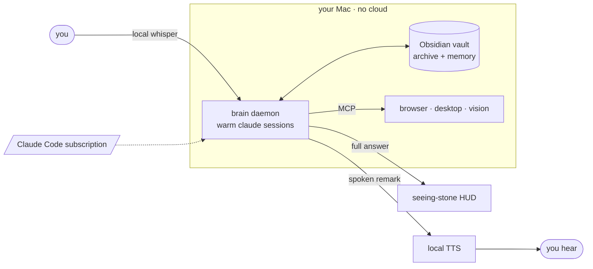

<div align="center">


# U R F A E L


**An old intelligence in service to one person: you.**

It listens, speaks, remembers, and acts — on the Claude Code subscription you already have.

[](#requirements)
[](#linux)
[](#voice)
[](LICENSE)

</div>

Urfael is a personal AI that lives on your Mac the way a counselor lives at your elbow. A gold seeing-stone waits in the corner of your screen; speak to it and a real voice answers while the full written answer lands beside it. An always-on local brain runs the `claude` CLI on your existing Claude Code login. An Obsidian vault is its archive; a private git repo is its memory; every conversation makes it a little more yours — it distills what it learned, keeps a model of who you are, and writes down the procedures it figures out so it never has to figure them out twice.

It speaks in remarks, not read-alouds. It stays silent unless something needs you. And it ships safe: power stays off until you turn it on, after reading [SECURITY.md](SECURITY.md).

## Quickstart

```bash
git clone https://github.com/Grandillionaire/urfael.git && cd urfael   # clone anywhere — the installer records the path
./install.sh        # checks deps, fetches the local speech model, scaffolds your vault — no keys
cd app && npm start # the Console opens
```

The **Console** is the app: chat with live tool activity, push-to-talk, the full conversation archive, reminders, background jobs, and settings — one window, keyboard-first (⌘1–6 views, ⌘K search). Prefer an ambient presence instead? Set `URFAEL_ORB=1` for the floating seeing-stone overlay and talk hands-free. That is a full voice assistant running on nothing but your Claude Code plan. Nicer voices, a spoken wake word (train a free custom "Urfael" keyword, or use a built-in one), and browser or desktop control are all opt-in, covered in [docs/SETUP.md](docs/SETUP.md).

**Hotkeys**   `⌘⇧O` open the Console  ·  `⌘⇧Q` quit  ·  orb mode adds `⌘⇧U` show/hide · `⌘⇧H` HUD · `⌘⇧T` look

## How it works

The desktop app is a thin client: the Console window (and, opt-in, a floating seeing-stone HUD with four looks: `sigil`, `rune`, `ember`, `eye`). The brain is an always-on `launchd` (macOS) / `systemd --user` (Linux) daemon of warm `claude` sessions, so it survives the UI closing and can act on its own. It simply runs your installed `claude` CLI as a subprocess, riding your existing Claude Code login — no API key, nothing to connect: if `claude` works in your terminal, the brain works. Most turns route to Sonnet; the hard ones — code, deep reasoning — escalate to Opus. Memory is plain markdown in a private git repo, re-injected every session. Voice in and out runs locally; the hands are opt-in MCP servers.



## What it can do

Everything below is opt-in and guard-railed. Urfael ships without unrestricted permissions or computer-use, and you turn power on deliberately.

- **Voice.** Push-to-talk in the Console, or (orb mode) speak the wake word and talk hands-free. The spoken remark streams sentence-by-sentence (first audio the moment the first sentence lands), and if an answer takes a while it acknowledges out loud — "On it, sir." — instead of leaving silence. You can also just type into the HUD.
- **Memory that compounds.** The vault holds its knowledge; a private git repo holds what it learns. Each conversation auto-distills into durable memory, lessons from its mistakes, and a model of who you are (`USER.md`) — all re-read every session.
- **Skills that grow + a paranoid hub.** When it figures out a multi-step procedure, it writes the recipe to `_urfael/skills/` and follows it next time instead of reasoning from scratch; an opt-in curator fixes or deletes stale ones. Share a skill (`urfael skills export`) or install one from a URL (`urfael skills install <url>`) — but it **previews the full content and runs a static safety scan first** (dangerous flags, exfil URLs, prompt-injection, hidden unicode), refuses to auto-install anything flagged, and never executes a skill. OpenClaw's skill hub shipped ~20% malware; ours installs blind never.
- **Total recall.** Every conversation, from every surface, is archived as plain JSONL in your memory repo. "What did I say about the Berlin trip?" — it ranks its own history (BM25) and cites the date. `urfael sessions search <query>` from any terminal.
- **A terminal voice.** The same brain answers in your shell: `urfael "summarize my inbox"` streams live; `status`, `jobs`, `reminders`, `remind`, `sessions search`, `stop`, `dashboard` manage the rest. Ctrl+C stops a turn. One daemon, every surface.
- **A full-screen cockpit.** `urfael tui` is a no-deps terminal UI — streamed transcript with live tool activity, a status bar, Esc to stop, and it always leaves your terminal clean.
- **A web console (and your phone).** `urfael dashboard` opens a token-gated localhost page (bound to 127.0.0.1 only, constant-time token, no path serving) — the browser surface Hermes and OpenClaw have, locked down harder. It's an installable, responsive **PWA**, so over a tunnel it's a real phone app.
- **Cost in plain sight.** Tokens and an estimated daily/7d/30d spend are computed from the local log — visible in the Console's Hearth panel, the dashboard, and `urfael status` (the rate is an env-overridable estimate, not a hardcoded fact).
- **Reminders.** "Remind me in 20 minutes" / "every morning at 8" just works — persisted in the daemon, fired as a notification, spoken aloud, and pushed to your phone, with every window closed.
- **Heartbeat (opt-in).** Every N minutes it runs your `HEARTBEAT.md` checklist — upcoming events, urgent email, slipping deadlines — and stays silent unless something genuinely needs you.
- **Calendar and email.** Read, create, and update Google and Apple Calendar plus Reminders. Drafts email, never sends.
- **Hands and eyes.** Drives the browser with Playwright, controls macOS apps, windows, and files, and sees the screen.
- **Visuals.** Ask for a chart or diagram and it makes one, in matplotlib, Mermaid, or interactive HTML.
- **Morning brief.** A spoken 8am rundown of your calendar, inbox, and open loops, with no window open.
- **Phone control — 8 channels.** Drive it from Telegram, Discord, Slack, iMessage, Email (draft-only), Matrix, Signal, or WhatsApp — owner-allowlisted, text or **voice memos** (transcribed locally, never by a cloud STT). Every one is sandboxed and read-only by default: a message can read and search your vault, but can't write files, run shell, fetch the network, or touch your machine (web lookup and capture are opt-in widenings). None opens an inbound port except WhatsApp, whose webhook binds to localhost behind your own tunnel and is HMAC-verified — see [docs/SETUP.md](docs/SETUP.md).
- **Background jobs.** Hand off long work (autonomous coding, deep research) to detached, cancellable jobs that don't tie up the conversation and push your phone when they're done.
- **Autonomous coding.** A `/goal` loop with caps, timeouts, and kill-switches — run it on the host, inside a throwaway `--network none` Docker container (only the claude auth files are staged in, never your secrets), or on a remote box over SSH. It never pushes.

## Voice

The default tier is fully local, offline, and free. Everything above it is optional.

| Tier | Speech to text | Text to speech | Cost |
|---|---|---|---|
| Default | whisper.cpp, on-device | macOS `say` | free, offline, no key |
| Quality | `small.en` model | [Kokoro-FastAPI](https://github.com/remsky/Kokoro-FastAPI), local | free, one extra service |
| Premium | ElevenLabs Scribe | ElevenLabs | paid, opt-in |

A wake word is optional via Picovoice — any built-in keyword works out of the box, and you can train a custom "Urfael" keyword free at console.picovoice.ai. Otherwise, tap the stone.

## Requirements

macOS, on Apple Silicon or Intel. [Claude Code](https://claude.com/claude-code) on a paid plan (Pro or Max), signed in. Node 18+. [Obsidian](https://obsidian.md) with its Local REST API plugin. One Homebrew line:

```bash
brew install ffmpeg whisper-cpp coreutils
```

The installer checks all of it and downloads the ~142 MB local speech model on first run. Sign in to Claude Code once before you start Urfael.

The brain uses Claude Code's model aliases, so it always tracks the latest models your plan supports. Opus escalation needs a **Max** plan; on **Pro**, set `URFAEL_OPUS_MODEL=sonnet` to keep everything on Sonnet (see [docs/SETUP.md](docs/SETUP.md)).

### Linux

macOS is the primary, best-tested target. Linux is **newer and less battle-tested**, but the headless brain core and the Electron GUI run there too: notifications go through `notify-send`, local TTS through `espeak-ng`/`spd-say`, screenshots through `grim`/`scrot`/`maim`/`import`, and the always-on daemon through a `systemd --user` unit instead of launchd. ElevenLabs/whisper.cpp work unchanged.

```bash
sudo apt install ffmpeg espeak-ng libnotify-bin grim   # + build whisper.cpp (whisper-server) yourself
systemctl --user enable --now urfael-daemon            # start the always-on brain
cd app && npm start
```

Swap `grim` for `scrot`/`maim`/`imagemagick` on X11. `install.sh` detects Linux and installs the `systemd --user` units for you (start with `systemctl --user enable --now urfael-daemon`; see [docs/SETUP.md](docs/SETUP.md)).

## A note on power

When you opt into full capability with `URFAEL_YOLO=1`, Urfael becomes a real agent with shell, file, and network access that also reads untrusted email and web. Run that mode in a VM or a throwaway account, and read [SECURITY.md](SECURITY.md) first.

## The name

Urfael is an original character: an old intelligence sworn to one person, woken into a machine. The name is a Sindarin-styled coinage; the mark is the **Uruz rune (ᚢ)** — the "U" of the Elder Futhark, the real, public-domain runic script that fantasy dwarf-runes were drawn from. No affiliation with any film, game, or estate is implied.

## Contributing

Issues and PRs welcome, see [CONTRIBUTING.md](CONTRIBUTING.md). Especially wanted: a Windows port, hardening of the Linux paths (they're newer), more local-voice backends, and new MCP hands. The newer bridges (Matrix, Signal, WhatsApp) are code-complete and reviewed but lightly field-tested — real-world reports help.

## License

[MIT](LICENSE), provided as is, without warranty. You are responsible for how you run it.

<sub>An independent open-source project, not affiliated with, endorsed by, or sponsored by Anthropic. "Claude" and "Claude Code" are trademarks of Anthropic.</sub>

<div align="center"><sub>If it's useful, a star helps others find it.</sub></div>
